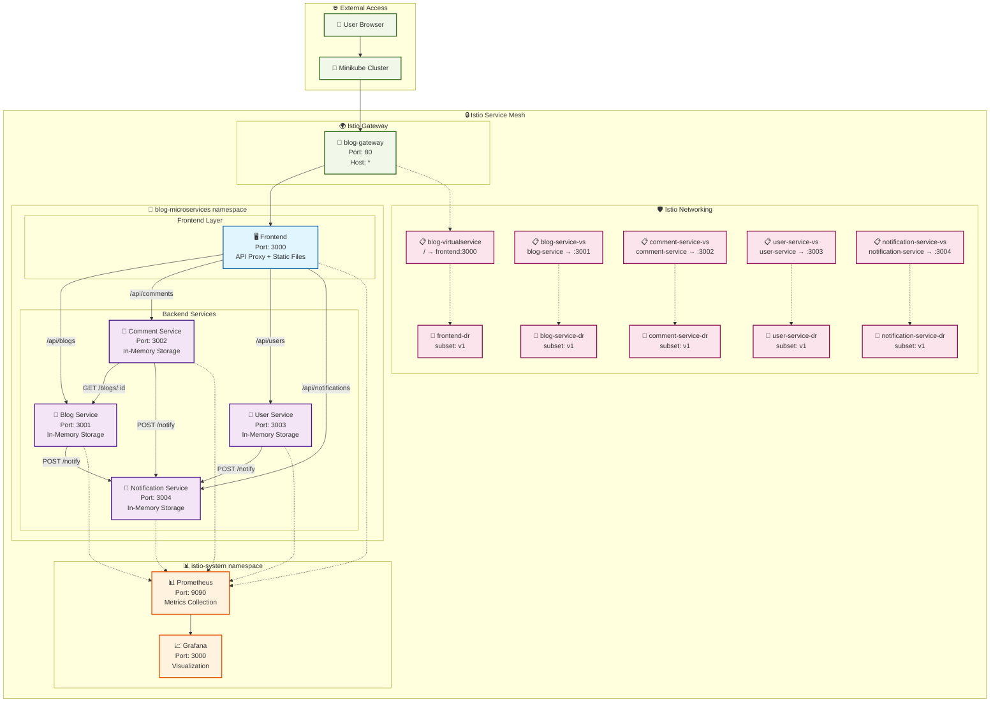
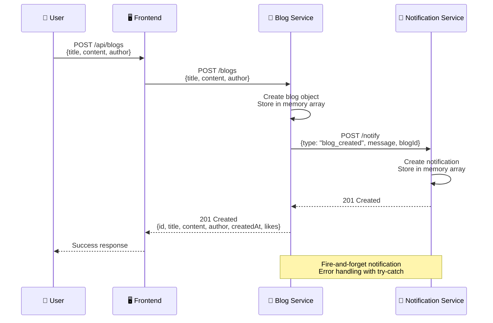
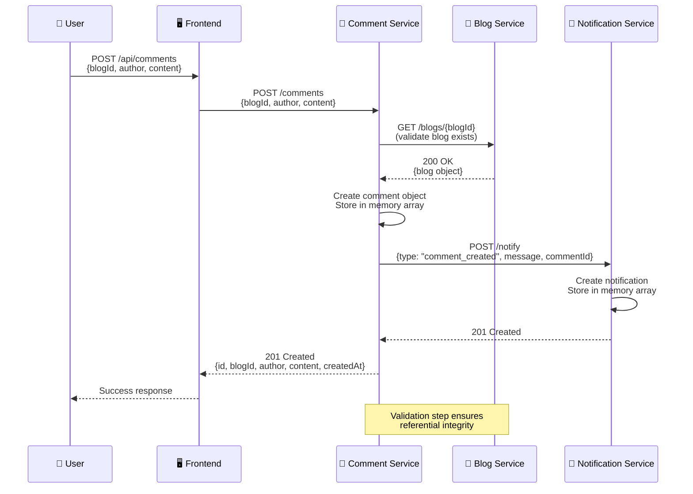
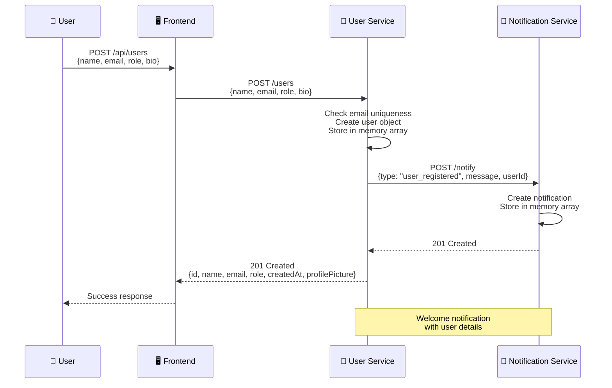
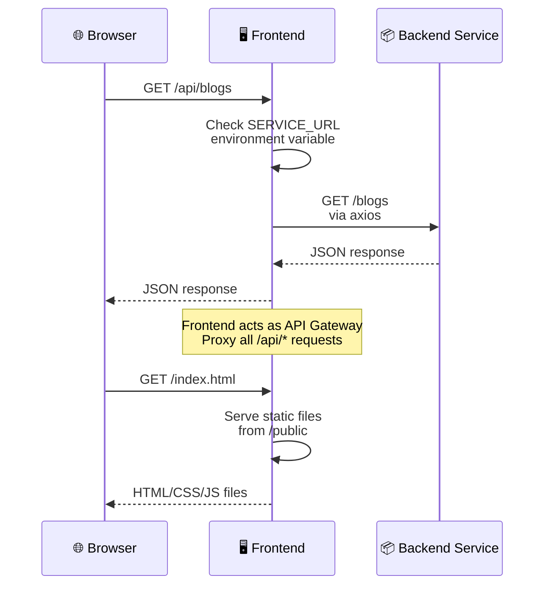
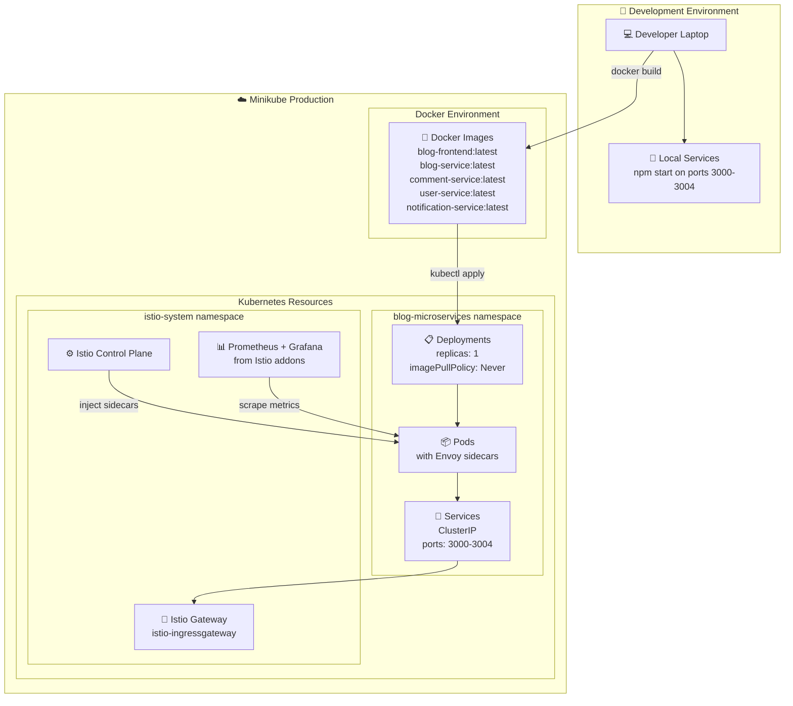
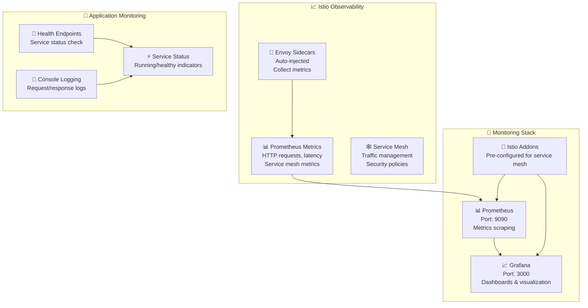

# 🎨 Sơ đồ Kiến trúc Hệ thống Blog Microservices

## 📊 Sơ đồ Kiến trúc Tổng quan



## 🔄 Luồng Dữ liệu Chi tiết

### 1. Luồng Tạo Blog Post



### 2. Luồng Tạo Comment



### 3. Luồng User Registration



### 4. Luồng Frontend API Proxy



## 🏗️ Kubernetes Deployment Architecture



## 🔐 Security & Configuration

```mermaid
graph TB
    subgraph "🔒 Istio Security"
        mTLS[🔐 Automatic mTLS<br/>Service-to-Service]
        Injection[💉 Sidecar Injection<br/>istio-injection: enabled]
        AuthPolicy[🛡️ Authorization Policies<br/>(Optional)]
    end
    
    subgraph "🌐 Network Configuration"
        Gateway[🚪 Gateway<br/>Port 80, Host: *]
        VirtualServices[📋 Virtual Services<br/>Routing Rules]
        DestinationRules[🎯 Destination Rules<br/>v1 subsets]
    end
    
    subgraph "🏢 Application Security"
        CORS[🌐 CORS Enabled<br/>All services]
        Validation[✅ Input Validation<br/>Required fields check]
        HealthChecks[🏥 Health Endpoints<br/>/health on all services]
        EnvVars[⚙️ Environment Variables<br/>Service URLs]
    end
    
    subgraph "📦 Services"
        Frontend[🖥️ Frontend]
        BlogService[📝 Blog Service]
        CommentService[💬 Comment Service]
        UserService[👥 User Service]
        NotificationService[🔔 Notification Service]
    end
    
    Injection --> Frontend
    Injection --> BlogService
    Injection --> CommentService
    Injection --> UserService
    Injection --> NotificationService
    
    mTLS --> BlogService
    mTLS --> CommentService
    mTLS --> UserService
    mTLS --> NotificationService
    
    Gateway --> VirtualServices
    VirtualServices --> DestinationRules
    
    CORS --> Frontend
    CORS --> BlogService
    CORS --> CommentService
    CORS --> UserService
    CORS --> NotificationService
    
    EnvVars --> Frontend
    EnvVars --> BlogService
    EnvVars --> CommentService
    EnvVars --> UserService
```

## 🗃️ Data Architecture

```mermaid
graph TB
    subgraph "💾 In-Memory Data Stores"
        BlogData[📝 Blog Data<br/>Array of blog objects<br/>- id, title, content, author<br/>- createdAt, likes]
        
        CommentData[💬 Comment Data<br/>Array of comment objects<br/>- id, blogId, author, content<br/>- createdAt, likes]
        
        UserData[👥 User Data<br/>Array of user objects<br/>- id, name, email, role<br/>- createdAt, profilePicture, bio]
        
        NotificationData[🔔 Notification Data<br/>Array of notification objects<br/>- id, type, message, timestamp<br/>- priority, read status]
    end
    
    subgraph "🔗 Service Interactions"
        BlogService[📝 Blog Service] --> BlogData
        CommentService[💬 Comment Service] --> CommentData
        UserService[👥 User Service] --> UserData
        NotificationService[🔔 Notification Service] --> NotificationData
        
        CommentService -.-> |Validate blogId| BlogService
        BlogService -.-> |Fire-and-forget| NotificationService
        CommentService -.-> |Fire-and-forget| NotificationService
        UserService -.-> |Fire-and-forget| NotificationService
    end
    
    subgraph "🎯 Sample Data"
        InitialBlogs[📚 3 Initial Blogs<br/>- Welcome to Microservices<br/>- Service Mesh Architecture<br/>- Kubernetes Best Practices]
        
        InitialComments[💭 5 Initial Comments<br/>- Distributed across blogs<br/>- From different authors<br/>- With timestamps]
        
        InitialUsers[👤 5 Initial Users<br/>- Different roles (admin, author, reader)<br/>- With profile pictures<br/>- Activity tracking]
        
        InitialNotifications[🔔 3 Initial Notifications<br/>- System initialized<br/>- User registered<br/>- Blog created]
    end
    
    BlogData --> InitialBlogs
    CommentData --> InitialComments
    UserData --> InitialUsers
    NotificationData --> InitialNotifications
```

## 📊 Monitoring & Observability



---

**Sơ đồ kiến trúc trên phản ánh chính xác hệ thống Blog Microservices thực tế dựa trên các file cấu hình Kubernetes, Istio, và source code của từng service.**
