# Blog Microservices Architecture Diagrams

## System Overview Architecture

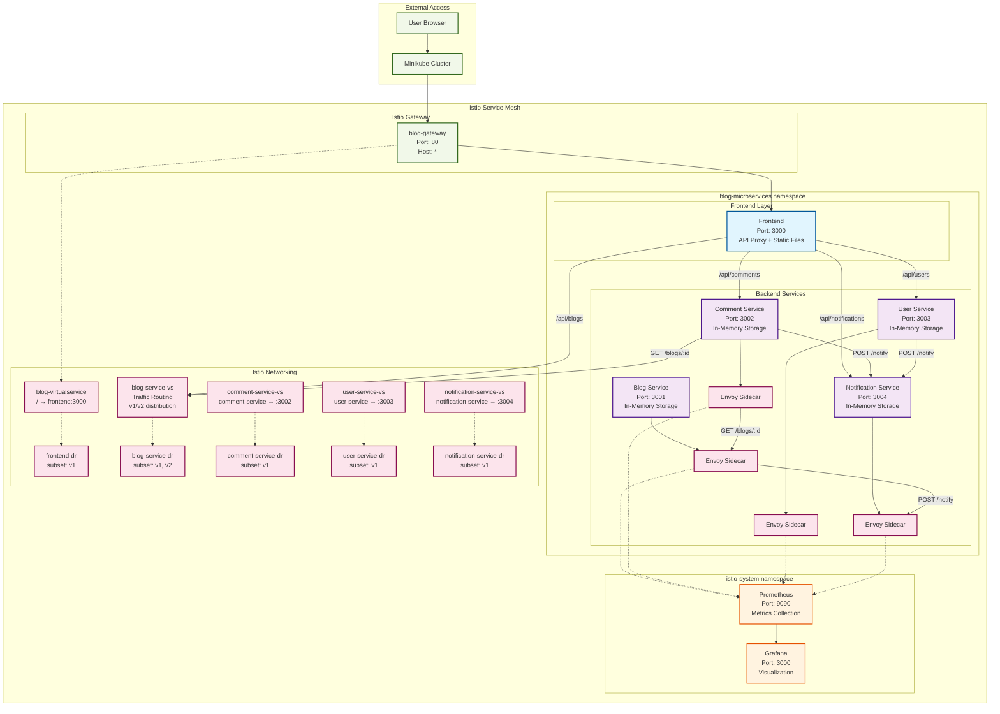

## Traffic Management Architecture

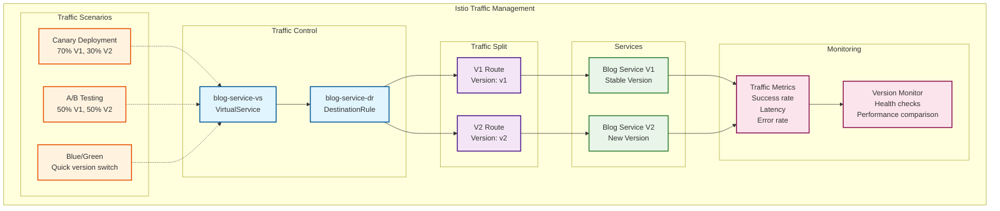

## Data Flow Details

### 1. Traffic Routing Scenarios

#### Canary Deployment (70% V1, 30% V2)
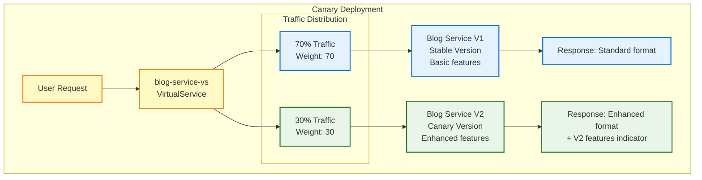

#### A/B Testing (50% V1, 50% V2)
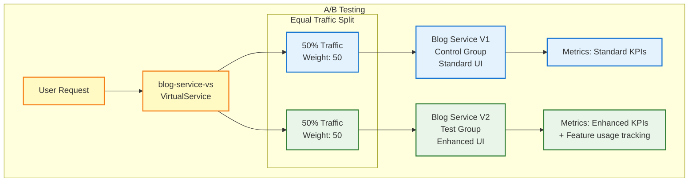

### 2. Blog Post Creation Flow (V1 vs V2)

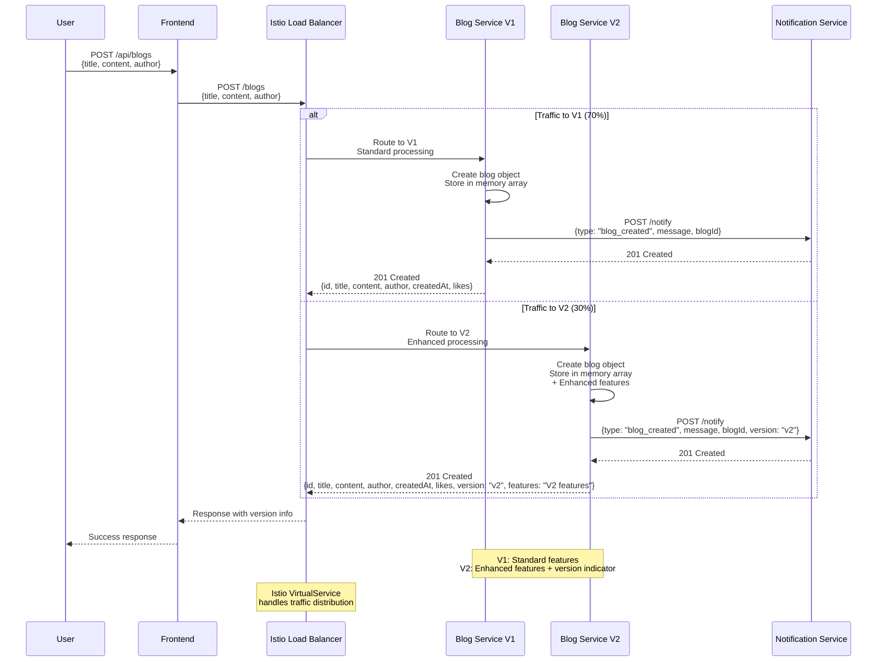

### 2. Comment Creation Flow

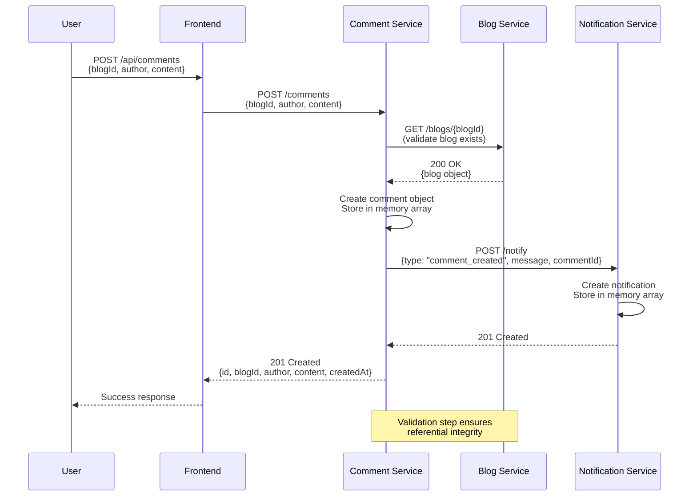

### 3. User Registration Flow

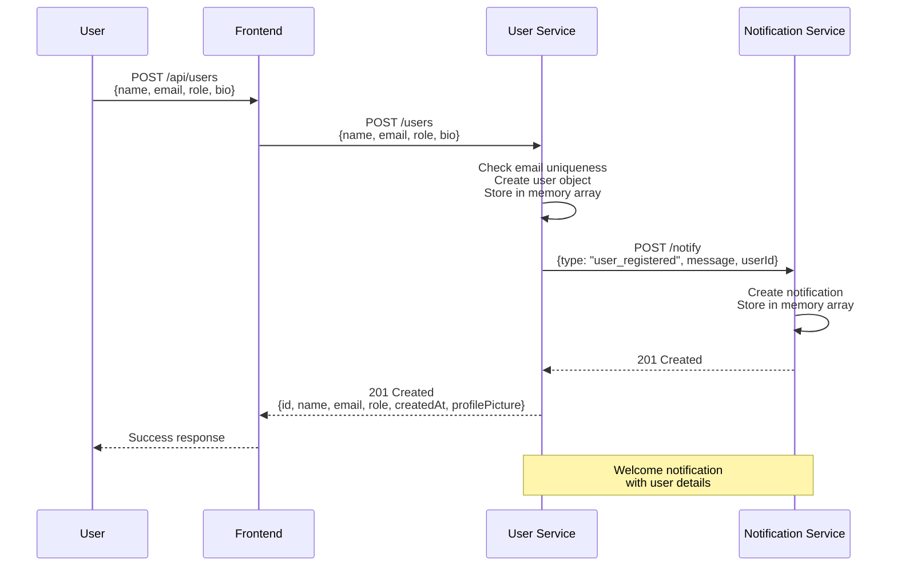

### 4. Frontend API Proxy Flow

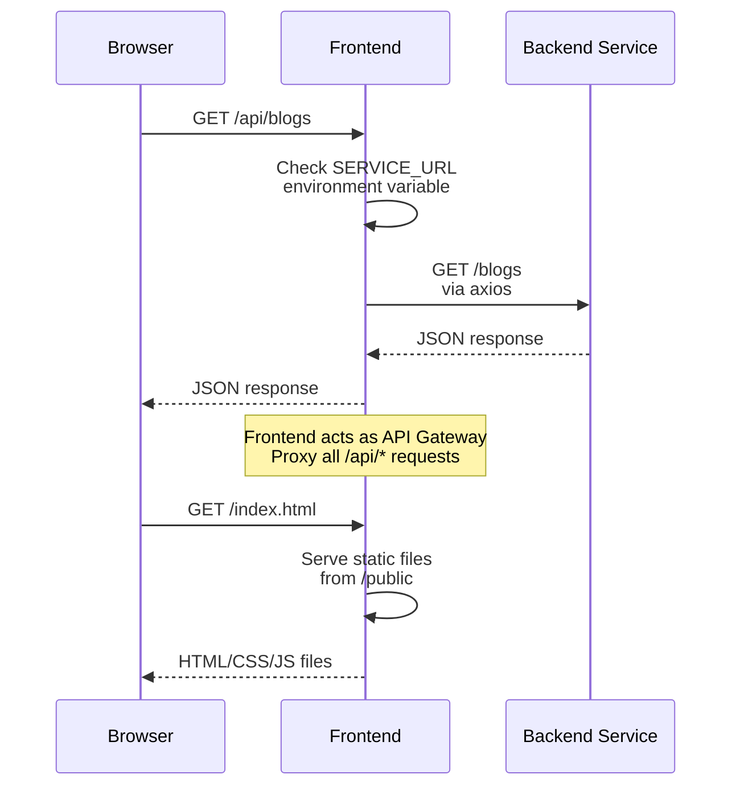

## Kubernetes Deployment Architecture

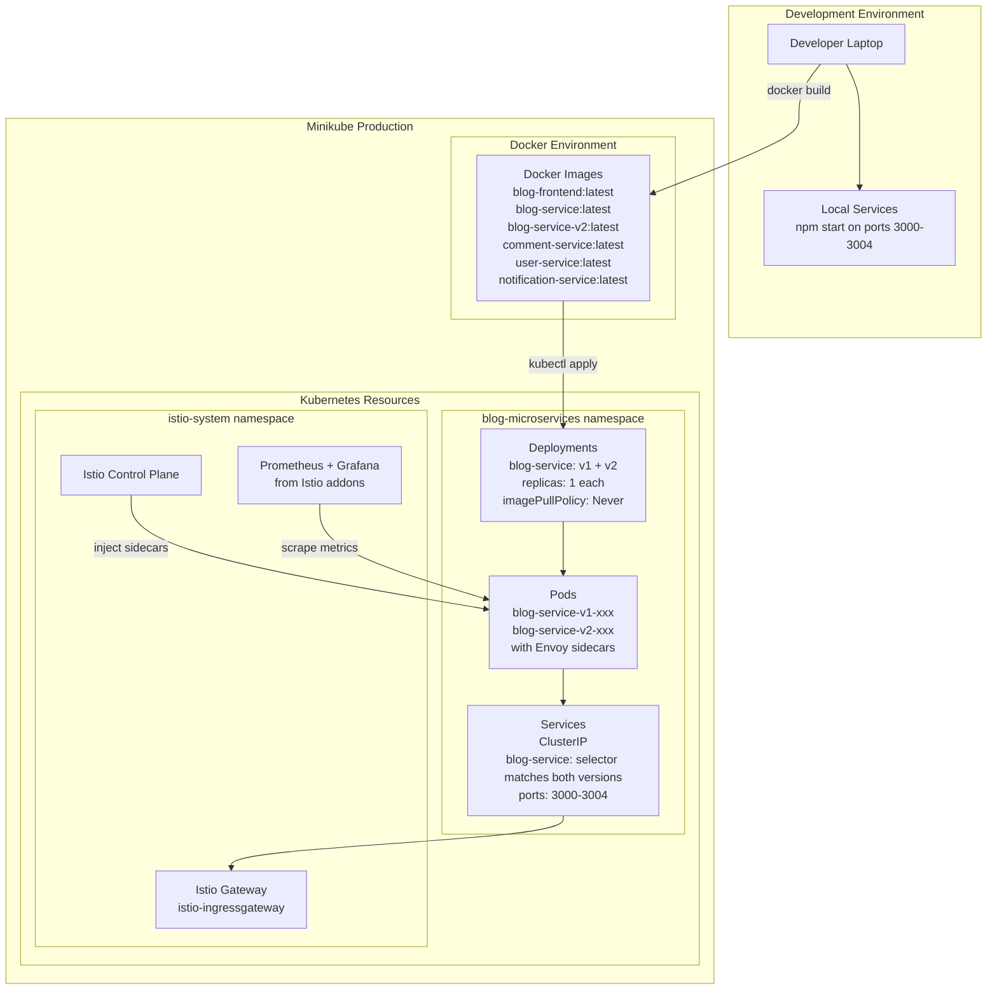

## Traffic Routing Configuration

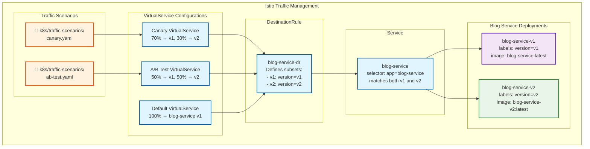

## mTLS Testing Architecture

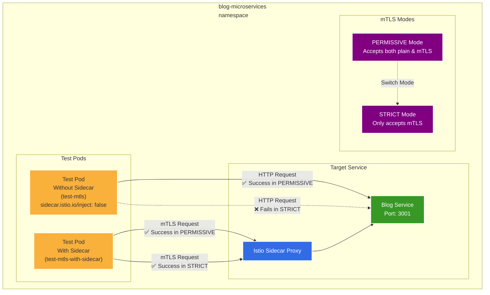

## Security & Configuration

```mermaid
graph TB
    subgraph "Istio Security"
        mTLS[Automatic mTLS<br/>Service-to-Service]
        Injection[Sidecar Injection<br/>istio-injection: enabled]
        AuthPolicy[Authorization Policies<br/>(Optional)]
    end
    
    subgraph "Network Configuration"
        Gateway[Gateway<br/>Port 80, Host: *]
        VirtualServices[Virtual Services<br/>Routing Rules]
        DestinationRules[Destination Rules<br/>v1 subsets]
    end
    
    subgraph "Application Security"
        CORS[CORS Enabled<br/>All services]
        Validation[Input Validation<br/>Required fields check]
        HealthChecks[Health Endpoints<br/>/health on all services]
        EnvVars[Environment Variables<br/>Service URLs]
    end
    
    subgraph "Services"
        Frontend[Frontend]
        BlogServiceV1[Blog Service V1]
        BlogServiceV2[Blog Service V2]
        CommentService[Comment Service]
        UserService[User Service]
        NotificationService[Notification Service]
    end
    
    Injection --> Frontend
    Injection --> BlogServiceV1
    Injection --> BlogServiceV2
    Injection --> CommentService
    Injection --> UserService
    Injection --> NotificationService
    
    mTLS --> BlogServiceV1
    mTLS --> BlogServiceV2
    mTLS --> CommentService
    mTLS --> UserService
    mTLS --> NotificationService
    
    Gateway --> VirtualServices
    VirtualServices --> DestinationRules
    
    CORS --> Frontend
    CORS --> BlogServiceV1
    CORS --> BlogServiceV2
    CORS --> CommentService
    CORS --> UserService
    CORS --> NotificationService
    
    EnvVars --> Frontend
    EnvVars --> BlogServiceV1
    EnvVars --> BlogServiceV2
    EnvVars --> CommentService
    EnvVars --> UserService
```

## Data Architecture

```mermaid
graph TB
    subgraph "In-Memory Data Stores"
        BlogData[Blog Data<br/>Array of blog objects<br/>- id, title, content, author<br/>- createdAt, likes]
        
        CommentData[Comment Data<br/>Array of comment objects<br/>- id, blogId, author, content<br/>- createdAt, likes]
        
        UserData[User Data<br/>Array of user objects<br/>- id, name, email, role<br/>- createdAt, profilePicture, bio]
        
        NotificationData[Notification Data<br/>Array of notification objects<br/>- id, type, message, timestamp<br/>- priority, read status]
    end
    
    subgraph "Service Interactions"
        BlogServiceV1[Blog Service V1] --> BlogData
        BlogServiceV2[Blog Service V2] --> BlogData
        CommentService[Comment Service] --> CommentData
        UserService[User Service] --> UserData
        NotificationService[Notification Service] --> NotificationData
        
        CommentService -.-> |Validate blogId| BlogServiceV1
        CommentService -.-> |Validate blogId| BlogServiceV2
        BlogServiceV1 -.-> |Fire-and-forget| NotificationService
        BlogServiceV2 -.-> |Fire-and-forget| NotificationService
        CommentService -.-> |Fire-and-forget| NotificationService
        UserService -.-> |Fire-and-forget| NotificationService
    end
    
    subgraph "Sample Data"
        InitialBlogs[3 Initial Blogs<br/>- Welcome to Microservices<br/>- Service Mesh Architecture<br/>- Kubernetes Best Practices]
        
        InitialComments[5 Initial Comments<br/>- Distributed across blogs<br/>- From different authors<br/>- With timestamps]
        
        InitialUsers[5 Initial Users<br/>- Different roles (admin, author, reader)<br/>- With profile pictures<br/>- Activity tracking]
        
        InitialNotifications[3 Initial Notifications<br/>- System initialized<br/>- User registered<br/>- Blog created]
    end
    
    BlogData --> InitialBlogs
    CommentData --> InitialComments
    UserData --> InitialUsers
    NotificationData --> InitialNotifications
```

## Service Version Comparison

```mermaid
graph TB
    subgraph "Blog Service V1"
        V1Features[Standard Features:<br/>- Basic CRUD operations<br/>- In-memory storage<br/>- Standard response format<br/>- Basic error handling]
        
        V1Response[Response Format:<br/>{<br/>  id, title, content,<br/>  author, createdAt, likes<br/>}]
        
        V1Docker[Docker Image:<br/>blog-service:latest<br/>Standard Node.js app]
    end
    
    subgraph "Blog Service V2"
        V2Features[Enhanced Features:<br/>- Advanced CRUD operations<br/>- In-memory storage<br/>- Enhanced response format<br/>- Advanced error handling<br/>- Version indicators]
        
        V2Response[Response Format:<br/>{<br/>  id, title, content,<br/>  author, createdAt, likes,<br/>  version: "v2",<br/>  features: "V2 features"<br/>}]
        
        V2Docker[Docker Image:<br/>blog-service-v2:latest<br/>Enhanced Node.js app]
    end
    
    subgraph "Traffic Distribution Strategy"
        ProductionUse[Production Use Cases:<br/>- Canary: 70% V1, 30% V2<br/>- A/B Test: 50% V1, 50% V2<br/>- Gradual rollout strategy]
        
        TestingStrategy[Testing Strategy:<br/>- Gradual rollout<br/>- Feature validation<br/>- Performance comparison<br/>- User experience testing]
    end
    
    subgraph "Monitoring & Metrics"
        V1Metrics[V1 Metrics:<br/>- Request count<br/>- Response time<br/>- Error rate<br/>- Standard KPIs]
        
        V2Metrics[V2 Metrics:<br/>- Request count<br/>- Response time<br/>- Error rate<br/>- Enhanced KPIs<br/>- Feature usage tracking]
        
        Comparison[Comparison Dashboard:<br/>- Version performance<br/>- Feature adoption<br/>- Error rates<br/>- User satisfaction]
    end
    
    V1Features --> V1Response
    V2Features --> V2Response
    V1Docker --> V1Features
    V2Docker --> V2Features
    
    V1Response --> V1Metrics
    V2Response --> V2Metrics
    V1Metrics --> Comparison
    V2Metrics --> Comparison
    
    ProductionUse --> TestingStrategy
    TestingStrategy --> Comparison
    
    classDef v1 fill:#e3f2fd,stroke:#1976d2,stroke-width:2px
    classDef v2 fill:#e8f5e8,stroke:#2e7d32,stroke-width:2px
    classDef strategy fill:#fff3e0,stroke:#e65100,stroke-width:2px
    classDef metrics fill:#fce4ec,stroke:#880e4f,stroke-width:2px
    
    class V1Features,V1Response,V1Docker,V1Metrics v1
    class V2Features,V2Response,V2Docker,V2Metrics v2
    class ProductionUse,TestingStrategy strategy
    class Comparison metrics
```

## Monitoring & Observability

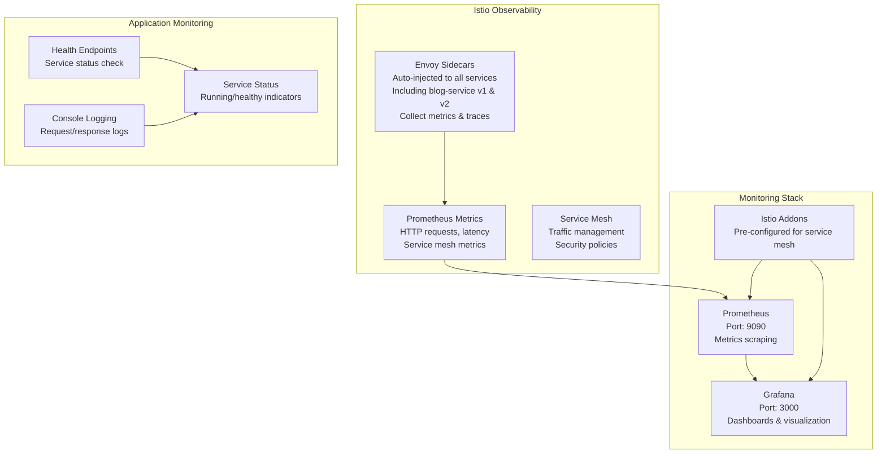

---

**This updated architecture diagram accurately reflects the Blog Microservices system with blog-service-v2 implementation, including traffic routing scenarios, version comparison, and enhanced monitoring capabilities based on Kubernetes configurations, Istio setup, and source code of each service.**
