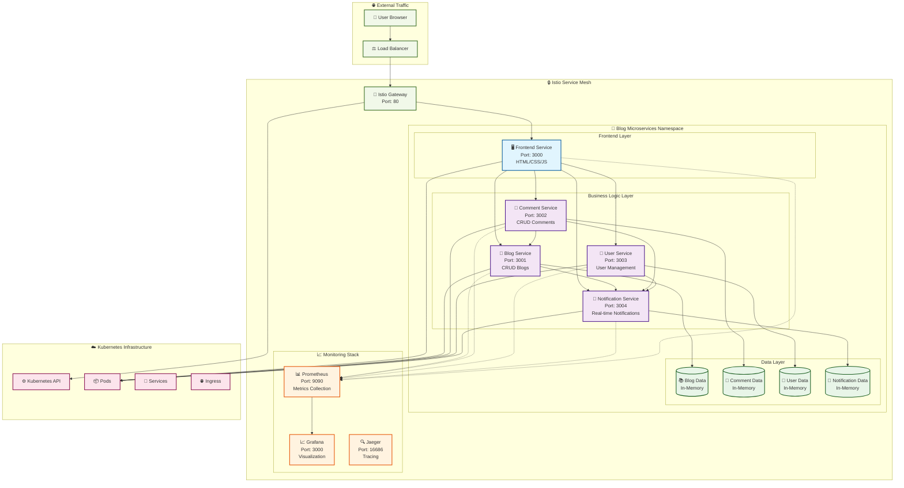
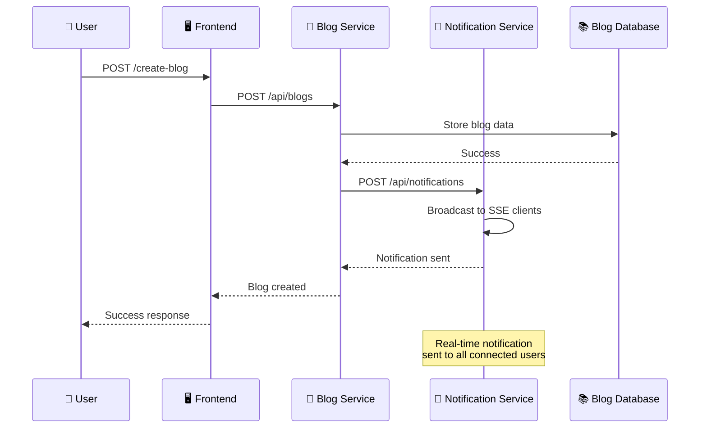
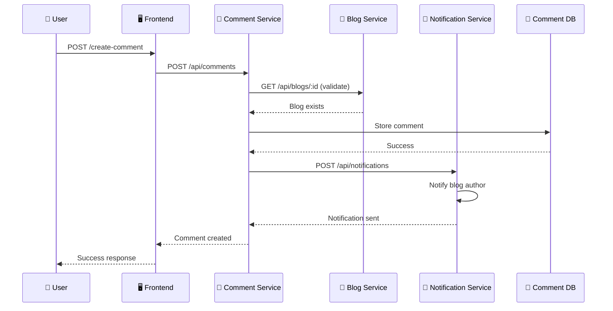
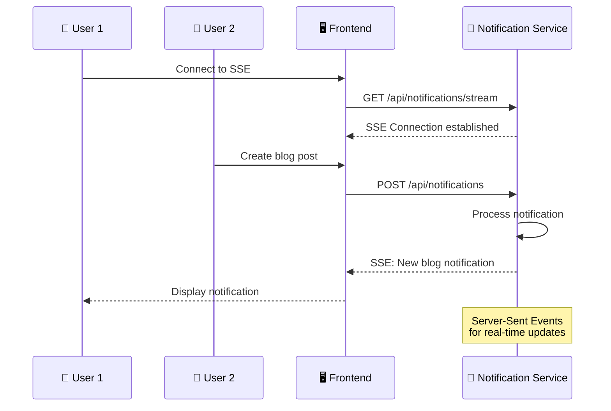
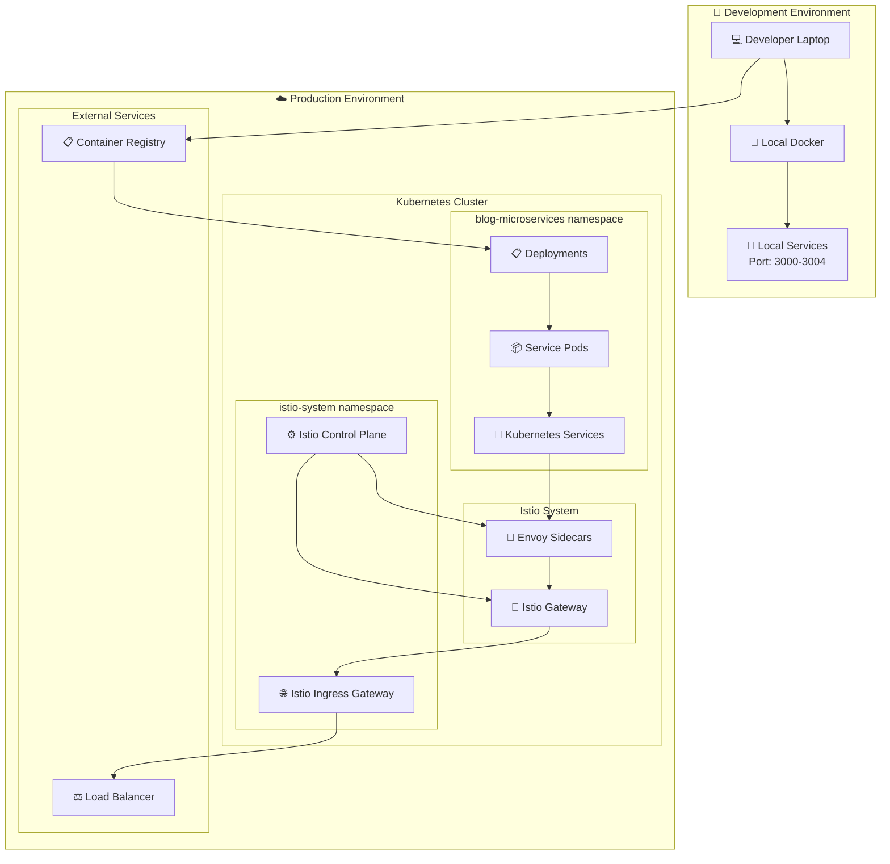
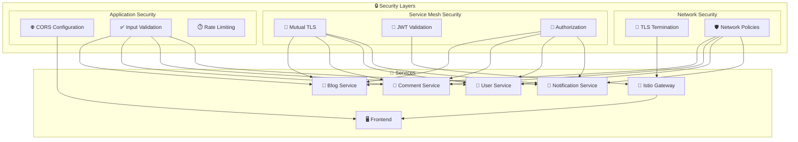
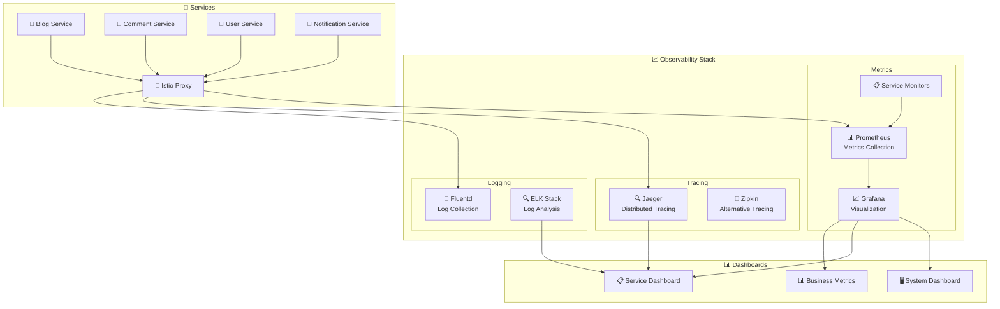

# 🎨 Sơ đồ Kiến trúc Hệ thống Blog Microservices

## 📊 Sơ đồ Kiến trúc Tổng quan

## 🔄 Luồng Dữ liệu Chi tiết

### 1. Luồng Tạo Blog Post

### 2. Luồng Tạo Comment

### 3. Luồng Real-time Notifications

## 🏗️ Deployment Architecture

## 🔐 Security Architecture

## 📊 Monitoring Architecture

## 🔄 CI/CD Pipeline

```mermaid
graph LR
    subgraph "🔨 Development"
        Code[💻 Source Code]
        LocalTest[🧪 Local Testing]
        Git[📦 Git Repository]
    end
    
    subgraph "🏗️ Build Pipeline"
        Build[🔨 Build Images]
        Test[🧪 Run Tests]
        Registry[📋 Push to Registry]
    end
    
    subgraph "🚀 Deployment Pipeline"
        Deploy[📦 Deploy to K8s]
        Configure[⚙️ Configure Istio]
        Monitor[📊 Setup Monitoring]
    end
    
    subgraph "✅ Verification"
        HealthCheck[🏥 Health Checks]
        SmokeTest[🔥 Smoke Tests]
        Production[🌐 Production Ready]
    end
    
    Code --> LocalTest
    LocalTest --> Git
    Git --> Build
    Build --> Test
    Test --> Registry
    Registry --> Deploy
    Deploy --> Configure
    Configure --> Monitor
    Monitor --> HealthCheck
    HealthCheck --> SmokeTest
    SmokeTest --> Production
```

---

**Các sơ đồ trên minh họa toàn bộ kiến trúc của hệ thống Blog Microservices từ góc độ người dùng đến infrastructure, bao gồm security, monitoring, và deployment pipeline.**
